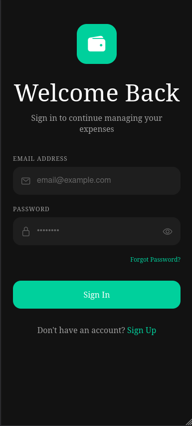
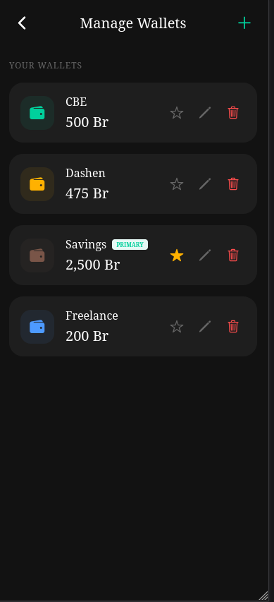
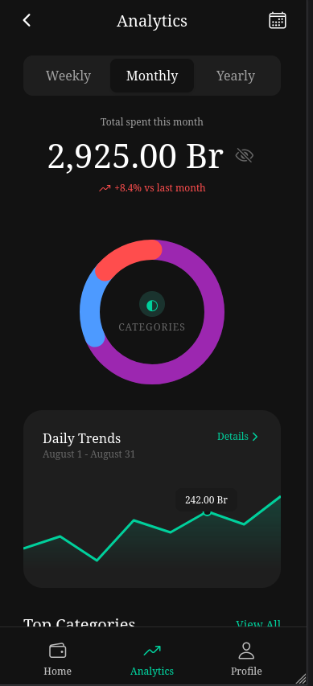
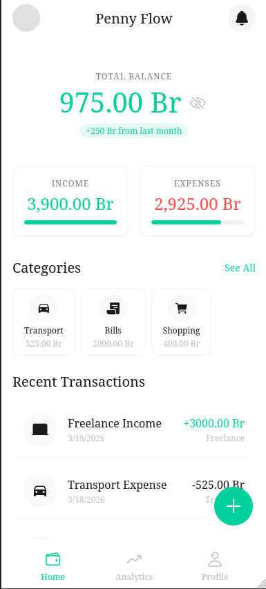
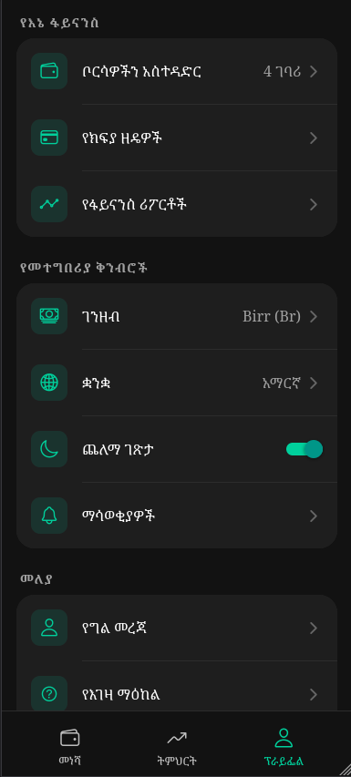

# Penny Flow 💰

A comprehensive, beautifully designed personal finance and expense tracking application built React Native, Expo, and Supabase. Keep track of your money efficiently, securely, and completely in your control.

## 🌟 Key Features

### 🔐 Secure Authentication
- **Powered by Supabase**: Secure email/password login integrated with Supabase Auth.
- **Session Management**: Native session handling keeps you securely logged in.
- **Profile Management**: View and modify your personal information directly within the app.



### 💳 Comprehensive Wallet Management
- **Multiple Wallets**: Create limitless wallets for different sources of income (e.g. Cash, Bank Accounts, Savings).
- **Customizable**: Assign different theme colors and custom names to each wallet.
- **Primary Wallets**: Set a default wallet for smooth and rapid transaction mapping.



### 📊 Expense Tracking & Analytics
- **Categorized Spending**: Sort your transactions into colorful categories (Housing, Food, Transport, Bills, etc.).
- **Interactive Insights**: Get detailed breakdowns via robust Donut Charts and Line Trend Graphs. 
- **Timeframes**: Filter your financial insights visually by Weekly, Monthly, or Yearly constraints.



### 👁️ Privacy & Stealth Mode
- **Stealth Mode**: Worried about wandering eyes in public? Instantly toggle Stealth Mode from the home screen or profile to mask your overall balances and transaction amounts with `••••`.


### 🎨 Beautiful & Accessible UI
- **Light & Dark Mode**: A sleek interface supporting native Light/Dark modes perfectly calibrated to provide visual joy while saving battery. 
- **Internationalization (i18n)**: Out-of-the-box language support including **English (en)** and fully localized **Amharic (am)** context files! Applied seamlessly across the app to cater to multiple demographics without reloading.
- **Glassmorphism & Crisp Typography**: We leverage premium design aesthetics ensuring an unparalleled mobile finance experience.




---

## 🛠 Tech Stack

- **Framework**: [React Native](https://reactnative.dev/) via [Expo](https://expo.dev/)
- **Backend & Database**: [Supabase](https://supabase.com/)
- **Navigation**: React Navigation (Native Stack + Bottom Tabs)
- **State & Storage**: React Context API & Async Storage
- **Charts**: Custom built interactive SVG-based Donut & Line Graphs.

## 🚀 Getting Started

### Prerequisites
- Node.js (>= 18.x)
- Expo CLI
- A running Supabase instance

### Installation

1. **Clone the repository**
   ```bash
   git clone https://github.com/y0hannes/penny-flow.git
   cd penny-flow
   ```

2. **Install dependencies**
   ```bash
   npm install
   ```

3. **Configure Environment Variables**
   Create a `.env` file in the root directory and add your Supabase credentials:
   ```env
   EXPO_PUBLIC_SUPABASE_URL=your_supabase_project_url
   EXPO_PUBLIC_SUPABASE_ANON_KEY=your_supabase_anon_key
   ```

4. **Start the Expo server**
   ```bash
   npx expo start
   ```
   Open the application in the Expo Go app or via an Android/iOS emulator.